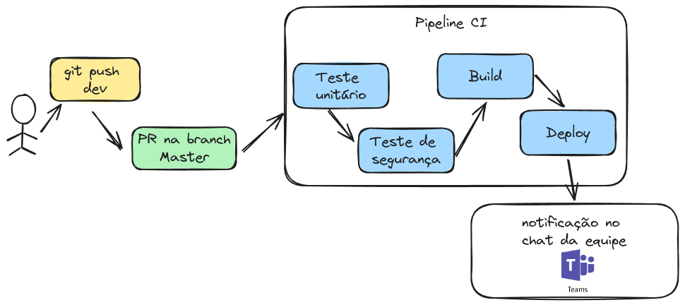
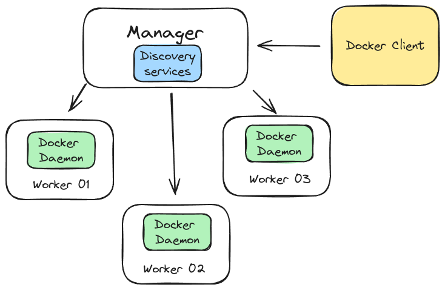

# Desafio DevOps

Teste Técnico para a Posição de DevOps

## whaomi

**Emerson Silva**

Atuo como DevOps Engineer,  possuo experiência em Administração de Sistemas Open Source, Virtualização, Cloud e ferramentas voltadas a práticas DevOps, com ênfase em IaC e CI/CD. 
Atuando há mais de 7 anos na área de Tecnologia da Informação.
Detenho expertise como instrutor de cursos voltados para Containers, Infraestrutura Ágile CI/CD.

- **Certificações**
  - GitLab Associate
  - Scrum Essentials
  - DevOps Essentials
  - AWS Certified Cloud Practitioner

# Perguntas

- [1. Configuração de Ambiente](#1-configuração-de-ambiente)
- [2. Controle de Versão](#2-controle-de-versão)
- [3. Integração Contínua/Entrega Contínua (CI/CD)](#3-integração-contínuaentrega-contínua-cicd)
- [4. Orquestração de Containers](#4-orquestração-de-containers)
- [5. Monitoramento e Log](#5-monitoramento-e-log)
- [6. Segurança](#6-segurança)
- [7. Infraestrutura como Código (IaC)](#7-infraestrutura-como-código-iac)
- [8. Resolução de Problemas](#8-resolução-de-problemas)
- [9. Cultura e Colaboração](#9-cultura-e-colaboração)
- [10. Projetos Pessoais](#10-projetos-pessoais)

# 1. Configuração de Ambiente

***a. Descreva os passos para configurar um ambiente de desenvolvimento local usando Docker, garantindo a integração entre aplicação e banco de dados.***

Antes de configurar um ambiente de desenvolvimento local usando o Docker, devemos instalar o Docker caso ele esteja instalado. 
Por ser um ambientes de testes, podemos usar a ```instalação por Script```, o Docker fornece scripts para instalação de maneira rápida e não interativa. O código fonte dos scripts está no [repositório](https://docs.docker.com/engine/install/ubuntu/) de instalação da própria ferramenta. Vale salienta que para ambientes de produção devemos utilizar via pacote ou binário, porque teremos controle de qual versão queremos baixar.

Execute o o comando curl abaixo para que seja realizado o download do script:

```$ curl -fsSL https://get.docker.com -o get-docker.sh```

Após realizado o processo anterior, execute o script;

```$ sudo sh get-docker.sh```

Feito esse passos, valide a instalação: 

```$ sudo docker info```

A saída do terminal será algo semelhante a isso: 

```bash
Client: Docker Engine - Community
 Version:    24.0.7
 Context:    default
 Debug Mode: false
 Plugins:
  buildx: Docker Buildx (Docker Inc.)
    Version:  v0.11.2
    Path:     /usr/libexec/docker/cli-plugins/docker-buildx
  compose: Docker Compose (Docker Inc.)

```

Como opção de deploy, podemos usar o Docker-compose, mas como estamos estruturando essa aplicação, podemos criar os containers por Docker CLI. 

- Criando Banco de dados usando MariaDB:

Para criar o banco de dados, vamos usar o ```docker run```, que é responsável pela criação de containers no Docker. Executamos o comando abaixo em nosso terminal e a API do docker vai se comunicar com o Docker Engine(daemon docker) e criar o nosso container seguindo os comandos que definimos abaixo. 


```$ sudo docker run -dit --name bernhoeft-db -h bernhoeft-db  -p 3306:3306 -e MARIADB_ROOT_PASSWORD=bernhoeft_pass mariadb```


- Criando deploy do PHPAdmin integrado com o banco de dados que criamos no passo anterior. 

```$ sudo docker run --name bernhoeft-phpmyadmin -h bernhoeft-phpmyadmin -d --link bernhoeft-db:db -p 8080:80 phpmyadmin/phpmyadmin```

-  O que cada paramatro do comando significa: 

```--name```: define o nome do container caso contrário, o Docker Daemon vai gerar um nome(ID) aleatório para o container. 
```-h```: Define nome de host, caso contrário, o Docker Daemon vai gerar um nome(ID) aleatório para o container. 
```--p```: Define qual porta vamos publicar a nossa aplicação.
```-e```: Shorname para --env, onde definimos váriaveis da aplicação
```-dti```: O parametro ```d``` define que esse container vai ser executado em background, enquanto o ```ti``` define a criação de um terminal interativo para esse container. 

Pronto, o agora temos uma aplicação integrada a um banco de dados. 

Basta acessar o endereço http://127.0.1:8080 e logar com o usuário root usando a senha que definimos na criação do container de banco de dados. 

# 2. Controle de Versão

***a. Como você lidaria com conflitos em um sistema de controle de versão (Git) durante um processo de integração contínua?***

Os conflitos no GIT acontece especialmente no momento de mesclagem das branches, o chamado ```merge``` ou quando vamos  fazer o ```pull``` de alterações. O Git trata o no versionamento como uma linha do tempo e cada commit que executamos, ele segue a ordem do mais antigo para o mais recente. 
O conflito de merge ocorre quando dois arquivos de mesmo nome possuem alterações nas mesmas linhas. Essa condição exige alteração do arquivo manualmente, para decidir qual modificação deverá prevalecer no commit.

Fora o próprio comando de merge, podemos utilizar o rebase e cherry-pick:

**rebase**: Permite que o desenvolvedor consiga mudar a base de uma branch em relação ao seu commit original.

Utilizar o rebase faz com que uma branch tenha sua origem modificada para incluir todas as alterações da branch desejada. Por exemplo, executando o rebase dentro da branch dev e passando como parâmetro a branch master, faz com que o ponto de criação da branch dev seja modificado para o topo da branch master, incluindo todos os commits da master que existam.

exemplo prático: 

- Vamos criar um fluxo de trabalho no nosso Git Local: 

```$ mkdir teste-conflito && cd teste-conflito```

```$ git init #Vamos inicializar o nosso repositório```

```$ echo "Alteração 01 \n Alteração 02" >> conflito.txt #Vamos criar algumas aleterações diretamente na Master```

```$ git add conflito.txt ```

```$ git commit -m "Alteração branch Master"```

```$ git checkout -b dev ## criar a branch dev ```

```$ echo "nova-linha " >> conflito.txt #Vamos criar uma linha diferente no arquivo conflito, na branch dev```

```$ git add conflito.txt && git commit -m "Alteração" #Vamos commitar na branch de Dev ```

```$ git checkout master #Vamos voltar para master```

```bash
$ git merge dev #Vamos realizar um Merge
Updating 7ce2570..bdefe2f
Fast-forward
 conflito.txt | 4 ++++

```
Agora hora de criar um conflito: 

Edite o arquivo diretamente na master:

```$ echo "vamos-conflitar " >> conflito.txt```
```$ git add conflito.txt && git commit -m "vamos conflitar" #Vamos criar o conflito```

```$ git checkout dev ## volte a branch dev ```

```$ echo "vai-dar-ruim" >> conflito.txt #Vamos criar uma linha diferente no arquivo conflito, na branch dev```

```$ git add conflito.txt && git commit -m "Alteração conflitante" #Vamos commitar na branch de Dev ```

```$ git checkout master #volte para master```

```bash
$ git merge dev #Realize o merge

Mesclagem automática de conflito.txt
CONFLITO (conteúdo): conflito de mesclagem em conflito.txt
Automatic merge failed; fix conflicts and then commit the result.

```
Se você executar o cat para visualizar que o arquivo ```conflito.txt``` vai visualizar as informações abaixo da linha que está dando conflito. 
``` 
<<<<<<< HEAD
vamos-conflitar 
=======
vai-dar-ruim
>>>>>>> dev
```
```$ git merge --abort #Vamos abortar o Merge```

```$ git checkout dev ## volte a branch dev ```

```$ git rebase master```


Outro caminho é editar manualmente a linha que está diferente. 

***b. Explique o conceito de "Git branching" e como você utilizará diferentes branches em um projeto.***

O conceito de "branching" no Git refere-se à prática de criar linhas de desenvolvimento independentes dentro de um repositório Git. Cada branch representa uma sequência de commits única, permitindo que você isole e trabalhe em funcionalidades, correções de bugs ou experimentos sem interferir diretamente na linha principal de desenvolvimento, conhecida como "branch master" ou "branch main" por padrão.

O uso de branches oferece vários benefícios no desenvolvimento de software, como por exemplo: 

**Desenvolvimento Paralelo**: Possibilita que várias equipes ou desenvolvedores individuais trabalhem em recursos diferentes simultaneamente, sem interferir uns nos outros.

**Testes e Experimentos**: Permite testar novas ideias ou implementar funcionalidades experimentais sem afetar a estabilidade do código principal.

**Correções Isoladas**: Facilita a correção de bugs sem introduzir mudanças não relacionadas ou não testadas em outras partes do código.

**Revisão de Código**: Facilita a revisão de código, pois cada branch representa uma unidade lógica e independente de trabalho.


# 3. Integração Contínua/Entrega Contínua (CI/CD)

***a. Descreva os benefícios da integração contínua em um ambiente de desenvolvimento.***

A Integração Contínua (CI) é uma prática crucial em ambientes de desenvolvimento modernos. Ela envolve a integração automática e frequente de código produzido por diferentes membros da equipe de desenvolvimento. Garantir a entrega automatizada dos ambientes é necessário para que possamos ter entregas cada vez mais rápidas e mapeadas para possiveis ajustes, promovendo um ciclo de desenvolvimento mais eficiente, confiável e adaptável, proporcionando benefícios tanto para os desenvolvedores como individuos quanto para as equipes como um todo.

Podemos listar alguns beneficios como: 

**Detectar Erros Rapidamente**: O CI realiza compilação e testes automáticos sempre que há uma alteração no repositório. Isso  nos ajuda a detectar erros e bugs rapidamente, antes que possam se propagar para outras partes do nosso código.

**Feedback Imediato aos Desenvolvedores**: a equipe de dev recebem feedback instantâneo sobre a qualidade do código que estão escrevendo. Isso incentiva práticas de codificação mais seguras e eficientes.

**Redução nos Conflitos de Código**:  com o CI, reduzimos a probabilidade de conflitos significativos de código. Isso facilita a resolução de conflitos menores e evita a acumulação de problemas complexos dentro código que estamos desenvolvendo. 

**Entregas Mais Rápidas:** : detectar problemas rapidamente, como citado acima, as equipes podem realizar entregas mais rápidas e iterativas. Isso é especialmente importante em ambientes ágeis e orientados a cultura DevOps.

**Automatizar Tarefas Repetitivas**: Com CI, reduzimos o tempo gasto em atividades manuais atráves de automação e permite que a equipe se concentre em tarefas mais complexas e criativas.

***b. Como você configuraria um pipeline de entrega contínua usando ferramentas como Jenkins ou GitLab CI?***

Para configuração de uma pipeline de CI, precisamos definir quais serãos os stages, que são as etapas que a nossa pipeline vai seguir e definir qual será a regra para execução dessa pipeline. Além da notificação da execução da pipeline para equipe responsável pela aplicação. 

- Stages
  - testes da aplicação
  - teste de segurança
  - build
  - deploy

Esboço dessa arquitetura:




Um exemplo de código no Gitlab-CI: 

```yaml 

stages:
 - test
 - build
 - deploy

test_users:
 stage: test
 image: python:3
 script:
  - cd $CI_PROJECT_DIR/AppWeb-python
  - pip install -r requirements.txt
  - python test_users.py

python-qualitygate:
 stage: test
 image: sonarsource/sonar-scanner-cli
 script:
  - cd $CI_PROJECT_DIR/AppWeb-python
  - sonar-scanner -Dsonar.projectKey=AppWeb-python -Dsonar.sources=. -Dsonar.host.url=http://sonarqube.34-170-148-91.nip.io -Dsonar.token=sqp_2965883ec3fbc4fd0cd8537f94351e6e4e903e65

kaniko:
  stage: build
  image:
    name: gcr.io/kaniko-project/executor:debug
    entrypoint: [""]
  script:
    - mkdir -p /kaniko/.docker
    - echo "{\"auths\":{\"${DOCKER_HUB_REGISTRY}\":{\"auth\":\"$(printf "%s:%s" "${DOCKER_HUB_USER}" "${DOCKER_HUB_PASSWORD}" | base64 | tr -d '\n')\"}}}" > /kaniko/.docker/config.json
    - >-
      /kaniko/executor
      --context "${CI_PROJECT_DIR}/AppWeb-python"
      --dockerfile "${CI_PROJECT_DIR}/AppWeb-python/Dockerfile"
      --destination "${DOCKER_HUB_IMAGE}:${CI_COMMIT_TAG}"

```

O exemplo acima corresponde a uma aplicação Web em Python. Essa aplicação possui o stage de teste unitário, teste de segurança e construção dos binarios da aplicação em uma imagem Docker. 

- **Teste Unitário**:
  
  Esse passo irá executar um script que vai validar a criação do usuário pertencente a aplicação

- **Teste de Segurança**: 

  Com auxilio da ferramenta SonarQube, o código fonte será analisado para averiguar se existe alguma vulnerabilidade de código, más práticas e mais algumas coisas que definimos no SonarQube. Após isso, vai gerar um relatório sobre o código, onde podemos criar regras para aprovação desse código. 

- **Build**:

  Nesse passo, após passarmos pelo estágio anterios, vamos construir nossa imagem de container, usando o Kaniko. Que é uma ferramenta voltada a construção de imagens de containers. Ele vai realizar o ```docker build``` e o ```docker push``` que conhecemos, versionando essa imagem de forma rápida e dinâmica. No exemplo, a imagem criada vai ser enviada para o DockerHub.

Para CD, Continuos Delivery/Continuos Deploy, podemos usar o próprio Gitlab-CI para realizar o deploy da aplicação ou ferramentas terceiras, como o ArgoCD para deploys no Kubernetes. 


# 4. Orquestração de Containers

***a. Compare as principais diferenças entre Kubernetes e Docker Swarm.***

Docker Swarm e Kubernetes são plataformas de orquestração de contêineres que facilitam a implementação, o dimensionamento e a gestão de aplicações baseadas em contêineres. Ambas as ferramentas oferecem soluções para lidar com a complexidade de gerenciar múltiplos contêineres em ambientes distribuídos. No entanto, há diferenças significativas em termos de arquitetura, recursos e comunidade de usuários. 

- **Docker Swarm**

O Docker Swarm é a solução nativa de orquestração de contêineres da Docker. Ele foi projetado para ser simples de usar e integrado diretamente ao ecossistema Docker. Ele segue uma abordagem de design mais simples, onde um nó é designado como "manager" e outros podem ser "workers". O manager gerencia o estado do cluster e coordena a execução dos contêineres nos nós workers. 




O Swarm é adequado para cargas de trabalho menores e para usuários que preferem uma configuração mais fácil. Ele é mais leve e pode ser uma escolha simples para casos de uso menos complexos. Está integrado diretamente ao Docker, o que facilita a transição para usuários que já estão familiarizados com as ferramentas Docker.


- **Kubernetes**

Kubernetes, muitas vezes chamado de "K8s", é uma plataforma de orquestração de contêineres de código aberto desenvolvida pela Google. Ele é mais complexo, mas oferece recursos mais avançados. Possui uma arquitetura mais complexa, consistindo em vários componentes, como Master (que inclui API Server, Controller Manager, Scheduler) e Nodes (que incluem Kubelet, Kube Proxy, Container Runtime).


É altamente escalável e projetado para gerenciar clusters de contêineres em grande escala. Ele é ideal para aplicações distribuídas complexas com múltiplos serviços e contêineres. Oferece uma maior flexibilidade em termos de configuração e personalização. Os usuários têm mais controle sobre como as coisas são implantadas e gerenciadas.


- **Diferenças entre Kubernetes x Docker Swarm**

  - O Docker Swarm é mais simples e fácil de configurar, enquanto o Kubernetes oferece mais complexidade e flexibilidade para ambientes mais complexos.

  - Kubernetes é mais adequado para ambientes de grande escala e aplicações complexas, enquanto o Docker Swarm é mais simples e adequado para cargas de trabalho menores.

  - Docker Swarm é integrado diretamente ao Docker, tornando-o uma escolha natural para usuários familiarizados com o Docker. Kubernetes tem uma integração menos direta. E partir da versão 1.24, o Docker deixou de ser nativo para a configuração do Kubernetes. Mas temos outras opções como o Cri-O.

Em resumo, a escolha entre Docker Swarm e Kubernetes depende das necessidades específicas do projeto, do nível de complexidade, da escala e da familiaridade dos usuários com cada plataforma. Para projetos menores ou iniciantes, o Docker Swarm pode ser uma escolha mais simples, enquanto o Kubernetes é a escolha preferida para ambientes complexos e de grande escala.


***b. Descreva como você escalonaria automaticamente um aplicativo em um cluster Kubernetes com base na carga de trabalho.***

Escalonar automaticamente uma aplicação em um cluster Kubernetes com base na carga de trabalho envolve o uso eficiente dos recursos disponíveis para atender às demandas variáveis. 

Primeiro passo, é compreender os gargalos da aplicação e entender o comportamento dela. Então é necessário a coleta de métricas. Isso pode incluir CPU, memória, tráfego de rede, entre outros. Usar o Prometheus ou outras ferramentas de monitoramento para coletar e armazenar essas métricas. 

Agora que temos coleta de dados, podemos partir para a definição de políticas de escalonamento, onde vamos definir uma regra para escalar de forma horizontal as Pods, de acordo com o aumento de respostas no Uso de CPU e de memória. 
O K8s possui um recuros chamado HPA(Horizontal Pod Autoscaler) que de forma automatica, aumenta o número de réplicas da aplicação em resposta à carga de trabalho.

Mas existem cenários onde a aplicação não aumenta o seu consumo de CPU e Memória, como vamos escalar usando o HPA de forma tradicional? Usando o Custom Resources, onde persolizamos um objeto dentro do Kuberentes, ai entra o Prometheus, por exemplo. 
Vamos supor que a aplicação em questão é uma aplica de Video Conferência como o Jitsi, ele trabalha com um microservice chamado Jibri, que cria a sala de conferência. Quando essas Salas estão ocupadas o Pod trava, porém, não aumenta o consumo de CPU ou Memória. Ele retorna um valor de heathceck chamado busy para salas ocupadas. Com um Prometheus criamos uma métrica personalizada que se durante a coleta for busy, ele vai voltar o valor 1. Se estiver OK, ele volta 0. 

Criado essa métrica, podemos criar um Custom Resource, e criar o HPA onde se o valor for igual a 0, ele aumenta a quantidade de Pods. 

# 5. Monitoramento e Log

***a. Explique a importância do monitoramento em um ambiente de produção.***

O monitoramento em um ambiente de produção é crucial para garantir o desempenho, confiabilidade e segurança dos sistemas. Ele fornece informações em tempo real sobre o estado do ambiente, permitindo identificar problemas rapidamente, otimizar o desempenho e tomar medidas proativas. 
Com um ambiente monitorado, temos uma detecção de problemas de forma mais preditiva, então podemos saber antes que o impacto chegue no cliente final, garantindo maior disponibilidade da aplicação. 
Além disso, temos a otimização desempenho das aplicações, pois, estamos visualizando o comportamento dela como um todo, e podemos trabalhar em cima das informações coletadas e melhorar o ambiente. Isso permite ajustes proativos para garantir uma experiência do usuário eficiente.
Por fim, garante a disponiblidade dos serviços, com a visulização rápida de possiveis eventos que possam impactar o negócio, que é essencial para garantir que um ambiente de produção esteja operando de maneira eficaz, eficiente e segura, permitindo a entrega consistente de serviços e aplicativos de alta qualidade aos usuários finais.


***b. Como você configuraria a coleta e visualização de logs em uma aplicação distribuída?***

Centralizar a coleta de logs é uma tarefa essecial dentro dos pilares DevOps de monitoramento e Observabilidade. 

Primeiro passo é definir um padrão de logs da aplicação que facilite a ánalise automatizada e a criação de consultas eficazes. Esturtando em Json ou em alguma outra estrutura que facilite as consultas. 

Feito isso é partir para usar uma ferramenta ou mais para a centralizar essa coleta, como por exemplo Filebeat para ELK Stack. Usando Elasticsearch e exibindo os dados usando o Grafana ou Kibana

# 6. Segurança

**a. Quais são as melhores práticas para garantir a segurança em uma implantação de aplicativos em contêineres?**

Para garatirmos a segurança em uma implementação de aplicações como containeres, seja um POD ou um container Docker no Swarm, precisamos nos atentar em alguns pontos importantes, como por exemplo. 
Mantenha todos os componentes do seu ambiente de contêineres atualizados, incluindo o sistema operacional, container runtime (como o Docker), e imagens de contêineres. Aplicar patches de segurança é fundamental para corrigir vulnerabilidades conhecidas.
Garatinr que as Imagens usem bibliotecas de fontes confiáveis também garante maior confiabilidade no nosso ambiente. 
Além disso, o isolamentos de recurso e menor privilégio dentro do container, desativar o usuário Root por exemplo. 
Por fim, garantir o monitoramento continuo, auditorias e logs da aplicação, para seja possível rastrear eventos anormais que possam ocorrer. 

***b. Como você lidaria com a gestão de segredos (como senhas e chaves API) em um ambiente DevOps?***

Em ambientes DevOps, a gestão e segredos é essencial para que possamos garatir a segurança em todo nosso eco sistema de aplicações. 
Como boa prática, é necessário que centralizemos a gestão se segredos, usando ferramentas como o Passbolt, Vault, seja o da Hashicorp por exemplo. Isso permite uma política consistente de controle de acesso e auditoria

Outro Ponto é evitar armazenar segredos diretamente nos arquivos de configurações do IaC ou diratente no código versionado no GIT. Utilizar ferramentas integradas é o melhor caminho para manter a confiabilidade. Com elas teremos a rotação singular de segredos, como o Vault faz.

Por fim, segregação de responsabilidades clara, para garantir que diferentes equipes ou usuários tenham acesso apenas aos segredos necessários para suas funções.


# 7. Infraestrutura como Código (IaC)

***a. Por que usar IaC? Explique as vantagens em termos de gerenciamento de infraestrutura.***

A Infraestrutura como Código, ou como conhecemos, IaC, é é tratar a infraestrutura da mesma maneira que o código-fonte de software, aplicando práticas como controle de versão, automação e testes. Isso traz benefícios significativos em termos de consistência, replicabilidade, eficiência e colaboração entre equipes de desenvolvimento e operações.

E ela traz como vantagens a capacidade de replicar ambientes de maneira consistente em diferentes estágios do ciclo de vida do desenvolvimento. A possibilidade de rasterar alterações com controle de versão em conjunto coma a redução de erros humanos, econimzando recurso e tempo. 

Por fim, facilita na colaboração entre as equipes, promovendo uma abordagem mais integrada e garantindo melhorar a eficiência, a confiabilidade e a agilidade no gerenciamento de infraestrutura de TI.

***b. Escreva um script de exemplo (usando ferramentas como Terraform) para provisionar um servidor web em um provedor de nuvem.**

A ferramenta escolhida, será o Terraform e o provisionamento será realizado na AWS. O primeiro passo é se conectar na AWS, então é necessário instalar o ```aws-cli```. Posteriormente instalar o ```Terraform``` na versão mais recente. 

Inicializado esses primeiros passos. vamos criar de um arquivo chamado ```variables.tf```

```json
variable "ami" {
    default = "ami-0885b1f6bd170450c"
}
variable "instance_type" {
    default = "t2.micro" 
}

variable "security" {
    default = "sg_olimpo"  
}
variable "ec2name" {
    default = "servidor-web" 
}

```
Nela vamos definir o nome da EC2, seu tipo, o S.O e o Grupo de Segurança AWS. 

Posso passo é criar o grupo de segurança, liberando a porta 80 e a porta 22. 

```Json

resource "aws_security_group" "sg_olimpo" {
  name        = var.security
  description = "Regras para liberar portas"


egress {
    from_port       = 80
    to_port         = 80
    protocol        = "tcp"
    cidr_blocks     = ["0.0.0.0/0"]
  }

ingress {
    from_port       = 22
    to_port         = 22
    protocol        = "tcp"
    cidr_blocks     = ["0.0.0.0/0"]
  }


  tags = {
    "Name" = "sg_olimpo"
    "Provider" = "terraform"
  }
  
}

```
Agora, podemos criar o arquivo ```main.tf```

```json
provider "aws" {
    region = "us-east-1"
}

resource "aws_instance" "zeus" {
    ami = var.ami
    instance_type = var.instance_type
    security_groups = ["sg_olimpo"]
    key_name = "aws-terraform"
    tags = {
        Name = var.ec2name
}

  provisioner "remote-exec" {
    inline = [
      "curl -fsSL https://get.docker.com -o get-docker.sh",
      "sudo sh get-docker.sh",
      "docker pull nginx",
      "docker run -i -t -d -p 80:80 nginx",
    ]

    connection {
      type        = "ssh"
      user        = "ec2-user"
      private_key = file("~/.ssh/aws-terraform.pem")  
      host        = self.public_ip
    }
  }
}


```
Nele vamos chamar as váriaveis que definimos no arquivo ```variables.tf``` e definir o provider, além da região que vamos realizar o deploy. E para complementar o provisionamento do NGINX como container usnado ```terraform-exec```. 

```$ terraform init #inicializa o diretório do projeto.```


```$ terraform validate #Valida sintaxes.```


```$ terraform plan #exibe o que vai ser criado.```

```$ terraform apply #aplica as configurações e provisiona os recursos definidos.```


# 8. Resolução de Problemas
***a. Descreva uma situação em que um deployment falhou, e explique como você abordaria a resolução desse problema.***

Se a analise não for rápida, dentro do SLA existente, é pertinente realizar um rollback seguro e voltando para a versão que estava funcionando. Após isso, é começar analisar os logs para identificar a natureza do problema. Procurar possíveis alertas que podem estar relacionado ao problema. Caso não encontre algo, validar as configurações de deployment, se as mesmas estão corretas. Certificar de que todas as variáveis de ambiente, configurações de banco de dados e outras configurações foram atualizadas corretamente.
Avaliar se todos os testes prévios ao deployment foram bem-sucedidos. Validar de que testes automatizados foram executados antes do deployment em produção. Enqquanto o problema é mitigado, fornecer atualizações frequentes sobre o progresso as partes interessadas.

Identificado o problema, praticar o Post Mortem, registrando a descrição do que foi o incidente, qual foi seu impacto, quais ações foram tomadas para mitigá-lo, quais foram as causas raizes do problema e quais ações devem ser acompanhadas para evitar que o incidente volte a se repetir. Realizando uma análise retrospectiva após a resolução do problema para identificar lições aprendidas. Isso contribuirá para aprimorar as práticas e evitar problemas semelhantes no futuro.

# 9. Cultura e Colaboração:

***a. Como você promoveria uma cultura de colaboração entre as equipes de desenvolvimento e operações (DevOps)?***

Promover a cultura DevOps vai além das ferramentas, é uma forma de trabalho com colaboração e estratégia entre a equipe de Desenvolvimento e Operações. 

E para que possamos proapagar isso, é atráves da compreensão do benefícios da cultura DevOps e a lidernaça também tem que estar comprometida em implementá-la. Esse comprometimento envolve apoio financeiro, suporte para mudanças culturais e a promoção de uma mentalidade colaborativa entre todos. 

A partir disso, podemos proporcionar o desenviolvimento da equipe atráves de treinamento e propagação de conhecimento, onde os colegas compartilham conhecimentos sobre DevOps com a equipe, como automação, ferramentas de CI/CD, práticas de monitoramento, entre outros. 

E para que possamos adquirir maturidade em DevOps é eliminar barreiras entre equipes, promovendo uma comunicação mais eficaz e a colaboração entre desenvolvedores, operadores, QA e outras partes interessadas. Vale salientar novamente que devemos encorajar o compartilhamento de conhecimento e experiência. 

Então podemos ir para ferramentas, onde podemos escolher qual melhor ferramenta de adapta ao ambiente para que possamos eliminar processos manuais, falta de feedbacks das aplicações e sanar isso com monitoramento e observabilidade e ter integração continua não somente com as ferramentas mas também entre todos os colaboradores. 

***b. Qual é a importância do feedback contínuo e como você facilitaria isso em um ambiente DevOps?***

O feedback contínuo desempenha um papel essencial na cultra DevOps, onde contribui para a melhora constante do produto, processo e a colabrações entre equipes. 

O que faz ele ser importante é a melhoria continua que ele traz, porque a cada feedback podemos aprimorar o produto. Ainda disso, podemos acrescentar a rápida indentifiação de problemas, isso garante agilidade na solução e faz a equipe ser preditiva, seja com monitoramento, CI/CD ou testes automatizados. 

O feedback contínuo grante maior resiliência não só do produto como todo, mas também de toda a equipe. 


# 10. Projetos Pessoais:

***a. Você possui algum projeto pessoal relacionado a práticas DevOps? Se sim, descreva brevemente***.

Costumo publicar códigos como contruibuição no GitHub, [https://github.com/silvemerson](https://github.com/silvemerson), onde compartilho conhecimento com a comunidade. Além de também participar de uma comunidade chamada DevOps Heroes, onde costumo palestrar sobre assuntos relacionados a DevOps. E por fim, tenho um blog sobre tecnologia, [https://emerson-silva.blog.br/](https://emerson-silva.blog.br/), onde publico regularmente artigos sobre DevOps. 

